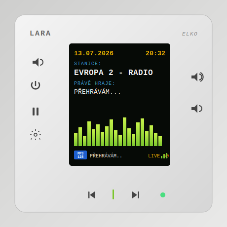

# lara-app

**Modern web control for ELKO EP LARA Radio/Intercom wall units — internet radio search, favorites on the physical buttons, and YouTube Music playback.**

The [LARA](https://www.elkoep.com/audiovideo-lara) is a lovely piece of Czech wall-mounted hardware with one problem: its firmware is stuck in the past. No HTTPS streams, no station search, no streaming services — just 40 station slots you edit in a clunky web form. This project fixes that. It runs on any always-on box on your LAN (NAS, Raspberry Pi, home server) and turns the LARA into a device you can actually enjoy.

<p align="center">
  
</p>

> ⭐ **If this project is useful to you, please star the repo** — it genuinely helps others find it and keeps the motivation up. Thank you!

## Features

- 🎛️ **Web replica of the physical panel** — play/stop, volume, next/prev, mute for every LARA on your network
- 📻 **Internet radio search** — 45,000+ stations via the community [Radio Browser](https://www.radio-browser.info) API, one tap to play. HTTPS-only stations play too: the LARA can't do TLS, so the backend transparently proxies them over plain HTTP on your LAN
- ⭐ **Favorites synced to the hardware** — your favorite stations are written into the LARA's physical station slots, so the **physical next/prev buttons on the wall browse your favorites** even without the app
- ▶️ **YouTube Music on a 2015 wall radio** — search any song and play it on the LARA. The music bridge downloads the audio, transcodes it to a plain MP3 stream the LARA understands, and serves it over your LAN. Queue, skip, seek and infinite autoplay included
- 🎵 **Now-playing metadata** — reads ICY StreamTitle from radio streams
- 🐳 **One `docker compose up`** — Go backend, Python music bridge, Next.js frontend, nginx

## How it works

The LARA has **no REST API**. Everything goes through a small binary protocol on `POST /data` (reverse-engineered; see [`backend/internal/protocol`](backend/internal/protocol)):

```
┌──────────────┐     ┌─────────────────────────────────────────┐
│   Browser    │────▶│  nginx :8500                            │
└──────────────┘     │   ├── /      → frontend (Next.js)       │
                     │   └── /api/  → backend  (Go :8400)      │
                     └──────────────────┬──────────────────────┘
                                        │ binary protocol (POST /data)
                     ┌──────────────────▼──────────────────────┐
                     │  LARA wall units (192.168.x.x)          │
                     │  40 station slots, 4 pages × 10         │
                     └──────────────────▲──────────────────────┘
                                        │ plain MP3 stream over LAN
                     ┌──────────────────┴──────────────────────┐
                     │  music bridge (Python :8282)            │
                     │  yt-dlp download → ffmpeg → MP3 + ICY   │
                     └─────────────────────────────────────────┘
```

**The slot trick:** to play an arbitrary stream, the backend writes the URL into station slot 0 ("current playing") and sends PLAY. Slots 1–39 hold your synced favorites, so the physical buttons keep working. The LARA can only fetch **short plain-HTTP URLs** (a slot fits 69 characters, no TLS) — https and long stream URLs are automatically aliased to short tokens and proxied through the backend (`/s?k=…`), and YouTube goes through the bridge, which turns any track into a boring MP3 stream on your LAN.

## Quickstart

Requirements: Docker + Docker Compose, one or more LARA units on your LAN, and a box to run this on (NAS, Pi, anything).

```bash
git clone https://github.com/honzatu/lara-app.git
cd lara-app
cp .env.example .env
# edit .env — set LARA_PASS and BRIDGE_LAN_URL (see below)
docker compose up -d --build
```

Open `http://<your-host>:8500`, add your LARA by name + IP, and play.

## Setting up your LARA devices

Every installation is different — your LARA units have **their own IP addresses and their own admin password**. All examples in this README (`192.168.1.x`) are placeholders; use your actual values.

**1. Find the IP address of each LARA**

Pick whichever is easiest for you:

- your **router's admin page** → list of connected devices / DHCP leases — LARA units show up as ELKO EP devices (check the MAC vendor),
- ELKO EP's official **LARA Configurator** (Windows tool) — discovers units on the LAN,
- a network scanner app (Fing, `nmap`…) — the LARA answers on port 80 with its built-in web UI.

Verify by opening `http://<ip-of-your-lara>` in a browser — you should see the LARA login page.

> 💡 **Give each LARA a static IP** (DHCP reservation in your router). If the IP changes later, the app loses the device until you update it.

**2. Know your LARA admin password**

The app talks to the LARA using the same credentials as its web login (user `admin`). The factory default password is printed in the ELKO EP manual — **if you (or your installer) changed it, use your changed password**. Set it as `LARA_PASS` in `.env`.

⚠️ Current limitation: one `LARA_PASS` is used for **all** devices, so all your LARA units must share the same admin password.

**3. Add devices in the app**

Open the app, fill in a name (e.g. *Kitchen*) and the unit's IP. Repeat for every LARA. Devices are stored in the app's local database — nothing is auto-discovered, nothing leaves your network.

**4. Set `LAN_HOST` — the one network setting that matters**

The physical LARA fetches YouTube audio and proxied https radio streams from the machine running `docker compose`, so `LAN_HOST` in `.env` must be **that machine's LAN IP** — not `localhost` and not an example value. Your NAS is `192.168.0.42`? Then `LAN_HOST=192.168.0.42`. That's it — bridge and proxy URLs are derived automatically.

### Configuration (`.env`)

| Variable | Required | Meaning |
|---|---|---|
| `LARA_PASS` | yes | Web admin password of your LARA units (factory default `elkoep` — change it!) |
| `LAN_HOST` | yes | LAN IP of the machine running docker compose, e.g. `192.168.1.10`. The physical LARA fetches YouTube audio and proxied https streams from this address |
| `BRIDGE_PORT` | no | Host port for the music bridge (default `8282`) |
| `BRIDGE_INTERNAL_URL` | no | How the backend reaches the bridge (default: docker service name) |

### YouTube Music — anonymous vs. your account

Works **anonymously out of the box** — search and play need no account. To use your own playlists/library (and Premium quality), export your browser headers into `bridge/headers.txt` — see [`bridge/headers.txt.example`](bridge/headers.txt.example) for the 2-minute how-to, then uncomment the mount in `docker-compose.yml`.

> ⚠️ **`headers.txt` contains your Google session cookies. It is gitignored — never commit or share it.** The same goes for your `.env` (LARA password). The Docker image never contains either.

YouTube playback uses [yt-dlp](https://github.com/yt-dlp/yt-dlp) under the hood. Use it for personal listening in your own home; respect YouTube's Terms of Service in your jurisdiction.

### Optional: Squeezebox / LMS mode (off by default)

By default lara-app controls the LARA entirely through its **direct binary protocol** — no LMS, no extra services, nothing to configure on the device. This is the recommended way and what everything above assumes.

The LARA can *also* act as a Squeezebox player ("Audio Zone" mode) if you specifically want that — e.g. to slot it into an existing [Lyrion Music Server](https://lyrion.org/) / Home Assistant multi-room setup. It is entirely opt-in: set `ENABLE_LMS=true` in `.env`, give your device its MAC address, and start the optional container:

```bash
docker compose --profile lms up -d
```

With `ENABLE_LMS` unset or `false`, none of the LMS code path runs — the binary protocol is used for every command.

## API

The backend exposes a plain JSON API on `:8400` — see route list in [`backend/cmd/lara/main.go`](backend/cmd/lara/main.go). Highlights:

```
GET  /api/v1/radio/search?name=jazz&country=CZ    station search
POST /api/v1/devices/{id}/play-radio              {"url": "...", "name": "..."}
POST /api/v1/devices/{id}/sync-favorites          write favorites to hardware slots
POST /api/v1/devices/{id}/play-bridge?video_id=…  play a YouTube track
GET  /api/v1/music/search?q=daft+punk             YouTube Music search
```

## Compatibility & disclaimers

- Tested with LARA Radio units (firmware with the 4-page × 10-slot station layout) on a local network.
- This is an independent open-source project, **not affiliated with or endorsed by ELKO EP**. LARA is a trademark of ELKO EP, s.r.o.
- The binary protocol was reverse-engineered from observing the device's own web UI. Writing station slots rewrites the device's flash — the app does this the same way the official UI does, but you use it at your own risk.

## Contributing & support

Issues and PRs welcome — especially reports from different LARA firmware versions.

If lara-app made your wall radio fun again:

- ⭐ **star this repository** — it's the best way to say thanks and helps others discover it
- 🐛 report bugs, request features in [Issues](https://github.com/honzatu/lara-app/issues)

## License

[MIT](LICENSE) © honzatu
